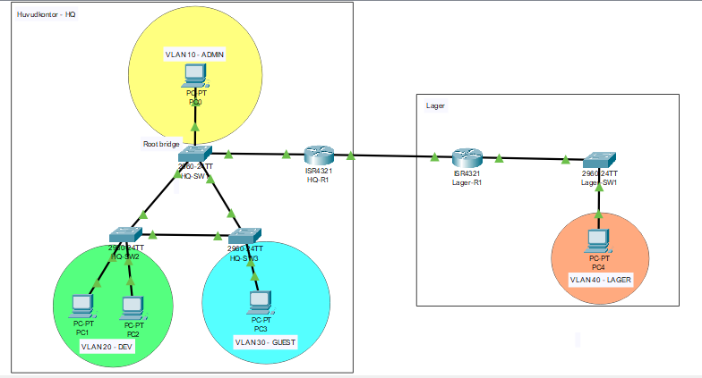

# Enterprise Nätverks- & Säkerhetsarkitektur (Cisco Packet Tracer)

Detta projekt omfattar en komplett, redundant enterprise-nätverksdesign för två siter (huvudkontor och lager) utvecklad i Cisco Packet Tracer med fokus på segmentering, routing och hög tillgänglighet.

---

## Nätverkstopologi

---

## 🛠️ Arkitektur & Tekniska Funktioner

-  **Två-site struktur:** Huvudkontor (HQ) och Lager sammankopplade med redundanta länkar.
- **Nätverkssegmentering:** Uppdelning i separata VLAN (Administration, Development, Gäst, Lager och Management).
- **Routing & Inter-VLAN:** Router-on-a-stick med 802.1Q subinterfaces på HQ; dynamisk routing via RIPv2 mellan siterna.
- **Switch- & Porthärdning:** Spanning Tree Protocol (STP) med BPDU Guard och dedikerat Native VLAN för att eliminera loopar och säkra trunkar.
- **IP-adress och subnetting:** Nätverket är uppdelat i mindre delnät så att varje avdelning får rätt antal adresser utan slöseri
---

## 📂 Hur man öppnar och testar laboratoriet

1. Ladda ner `Cisco labb.pkt`-filen från detta repository.
2. Öppna filen i **Cisco Packet Tracer**.
3. Verifiera anslutningar via pingtester mellan respektive VLAN och mellan siterna, eller granska switch- och routerkonfigurationerna via CLI (`show running-config`, `show ip route`, `show vlan brief`).
